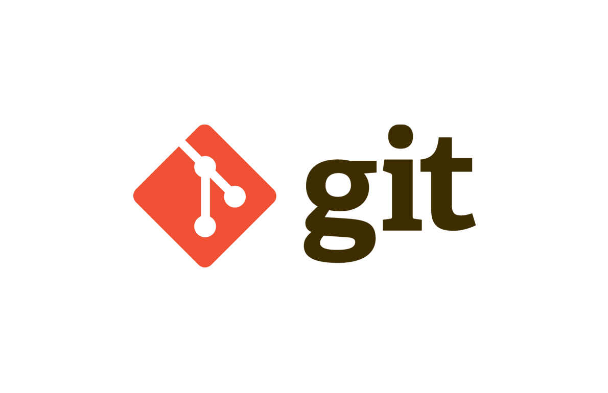
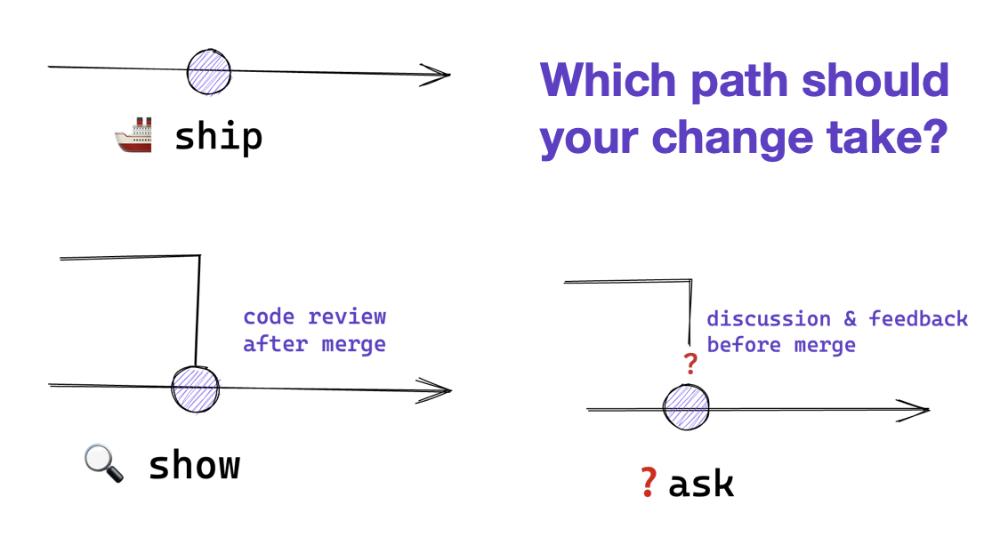

## CLASE 1

### ¿Cómo iniciar un proyecto de git?
Se crea un repositorio local con:

``git init <nombre-del-proyecto> ``

O iniciar en una carpeta ya existente , simplemente ir raíz del proyecto y poner.

`git init`

### Ayuda en git
Para resolver dudas de comandos de git, usamos:

`` git init -h``

si queremos información mas detallada podemos entrar a un articulo de git a través del navegador por medio de :

``git init --help``

### Estados de git
Cualquier archivo dentro de un directorio con git debe pasar por 3 estados:

+ **Modified**
+ **Staged**
+ **Commited**
------------------
**Modified**

Estado encargado de marcar todos los cambios que tiene un archivo sin confirmar.

Al crear un archivo dentro del directorio de git ya esta en un estado modified, también lo estará cuando lo eliminemos 

###### COMANDO PARA ELIMINAR ARCHIVO

``git rm <nombre-del-archivo>``

##### COMANDO PARA VER EL ESTADO DEL GIT

``git status``

##### COMANDO PARA RESTAURAR ARCHIVO
``git restore <nombre-del-archivo>``

**Staged**

Después de crear el archivo, debemos marcarlo para prepararlo para su confirmación en el repositorio 

##### COMANDO PARA CONFIRMAR
``
git add <nombre-del-archivo>
``

**Commited**

Este estado es para guardar los cambios de nuestro archivo, es decir es cuando nuestro archivo ya esta grabado en el repositorio local

##### COMANDO PARA GUARDAR CAMBIOS

``git commit <nombre-del-archivo>`` 

Para no tener que abrir el editor de codigo 

``git commit -m <el-mensaje-del-commit>”``

##### COMANDO PARA VER HISTORIAL DE COMMITS

``git log``

Para solo ver los títulos de los commits, sin autor ni fecha se usa

``git log --oneline``

para ver los commits como graficos utiilzamos

``git log –graph`` 

se puede combinar en un solo comando

``git log –graph –oneline``

## CLASE 2
##### COMANDO PARA CREAR UNA RAMA

``git Branch <mi-primera-rama>
``
##### COMANDOS PARA CAMBIAR DE RAMA

``git switch <mi-primera-rama>``

``git checkout <mi-primera-rama>``

para crear una rama y cambiar a ella con un solo comando se usa:

``git switch -c <mi-primera-rama>``

##### COMANDO PARA VER  LAS RAMAS

Para ver las ramas locales

``git branch``

Pare ver todas las ramas, locales y remotas 

``git Branch -a``

##### COMANDO PARA FUSIONAR RAMAS

Sirve para unir los cambios de una rama a la rama en la que nos situamos

``git merge``

##### COMANDO PARA ELIMINAR RAMAS

Se eliminan ramas para mantener el lugar de trabajo más organizado

``git Branch –d <mi-primera-rama>``

Para borrar una rama sin importar si esta fusionada o no

``git Branch -D <mi-primera-rama>``

### Conflictos

Se produce conflictos cuando git no es capaz de determinar que cambio es el que tiene que quedarse cuando fusionen las ramas, por lo que el usuario tiene que resolver

Para arreglarlo podemos elegir los cambios de que rama mantenemos o también personalizarlo para mantener los cambios de ambos pero en distintas líneas 

## CLASE 3
***ORIGIN.-***
Este será el nombre de la rama remota, es predeterminado pero cuando trabajemos con mas ramas remotas podrán tener otros nombres

##### COMANDO PARA ENLAZAR REPOSITORIO LOCAL AL REMOTO

``git remote add origin <url-de-repositorio-remoto>”``

La url puede ser la https o ssh

###### COMANDO PARA VER SI SE CONECTO EL REMOTO CON EL LOCAL 

``git remote -v``

##### COMANDO PARA SINCRONIZAR EL LOCAL CON EL REMOTO

``git push origin main``

##### COMANDO QUE NO SE DEBE HACER

``git push -f origin main``

Esto eliminaría archivos del repo remoto, muy peligroso si trabajamos en equipo

##### COMANDO PARA CLONAR REPOSITORIO
Se clonan todos los archivos y ramas del repositorio remoto con:

``git clone <url-de-repositorio-remoto>``

### Crear rama remota

``git push origin <nombre de-la-rama-creada>``

###### COMANDO PARA ACTUALIZAR RAMAS

``git fetch``

##### COMANDO PARA ELIMINAR RAMAS DEL REPOSITORIO REMOTO EN MI REPOSITORIO LOCAL

``git remote prune origin``

## CLASE 4 

#### GIT PUSH

Llevar modificaciones de mi repositorio local a uno remoto

#### GIT PULL

Traer modificaciones del repositorio remoto a mi repositorio local

##### COMANDO PARA ACORTAR EL GIT PUSH
Para solo poner git push en vez de repetir siempre el git push origin“nombre de rama”, tenemos que usar este comando

``git push -u origin <nombre-de-rama>``

##### COMANDO PARA ACORTAR EL GIT PULL

``git push –set-upstream origin “nombre de rama”``

Para pull no hay forma abreviada con -u

##### COMANDO PARA SUBIR TODAS LAS RAMAS AL REPOSITORIO REMOTO

``git push  --all``

##### COMANDO PARA BAJAR TODAS LAS RAMAS A MI REPOSITORIO LOCAL

``git pull --all``

### Pull request

Petición de cambios que se envía al repositorio local
Para hacer una buena pull request debemos enfocar nuestro código en una sola cosa y explicarla

## CLASE 5 Y 6

### Git Flow

**Main .-** contiene el codigo de producción

**Develop.-** código de preproducción que debe ser probado y evaluado

**Feature.-** características nuevas para el proyecto

**Release.-** cambios de ultimo momento

**Hotfix.-** parches o arreglar bugs pequeños

### Github Flow
Una alternativa simple que solo contiene una rama main y cualquier otra rama se agrega por una pull request

### Trunk base development

Estrategia que prioriza hacer commits directamente a la rama principal

#### SHIP/SHOW/ASK

**Ship.-** se fusiona en la rama principal sin revisión previa

**Show.-** abre una petición de cambios para ser revisados y cuando son aceptados se fusionan inmediatamente

**Ask.-** abre una pull request para discutir cambios antes de fusionarlos

### Buenas practicas

Es un estándar manejado en la mayoría de equipos de desarrollo ara resolver conflictos durante su desarrollo

Hacer commits a menudo, agrupando pequeñas mejoras, no significa hacer commits sin sentido, hacer buenos commits, que sean claros y con buena semántica.
Unos buenos commits no contienen puntos finales ni suspensivos, como máximo 50 caracteres para escribir el commit

También es bueno escribir un buen nombre de rama, preferible si el nombre de la rama es dado por la acción que realiza

## CLASE 7
#### DESHACER CAMBIOS 

Podemos deshacer cambios en caso de :

+ Dejo de funcionar el proyecto
+ Para recuperar código que eliminamos
+ Recuperar archivos eliminados

## GIT RESET- comando destructivo

Este comando descarta los cambios, ósea regresa a lcommit y elimina los cambios

``git reset --hard <ID-del-commit>``

Y este otro comando regresa al commit pero no elimina los cambios

``git reset --soft <ID-del-commit>``

## GIT REVERT- Comando no destructivo
Este comando no descarta cambios sino crea otro commit con los cambios revertidos, no borra ni rgres sino crea una versión con los cabios revertidos del commit

## GIT CHECKOUT.- nos permite recuperar código de los commits

## CLASE 8

### HOOK

Punto de enganche, con posibilidad de ejecutar una acción o script cada vez que ocurre un evento en determinado Git

#### CREANDO MI PRIMER HOOK

Solo tienes que crear un archivo nombre-del-hook en la carpeta .git/hooks y ahí poner el código que quieras que se ejecute
Puedes usar todo tipo de interpretes de lenguaje de programación como bash, node, Python, perl, etc.

**Hooks del lado del cliente**

**Pre-commit.-** para comprobar que no se haga commits de demasiados archivos

**Prepare-commit-msg.-** modificar el mensaje del commit o añadir cualquier información extra

**Commit -msg.-** para hacer comprobaciones pertinentes al mensaje

**Post-commit.-** notificar por slack

**Pre-push.-** para ejecutra una batería de tests

**Post-checkout y post merge.-** permite limpiar el directorio de trabajo, tras realizar un checkout o al del limpiar ramas que ya no usaremos
Hook del lado del servidor

**Pre-receive.-** para comprobar que los commits que se quieren guerdadr están bien hechos

**Update.-** puedes evitar de una formula granular cada actualizacion

**Post-receive.-** enviar un correo a todos los usuarios del repositorio que se han grbado nuevos cambios en el repositorio remoto 

### ¿Qué es un alias?

Son los que permiten definir una serie de comandos que pueden ser usados en lugar de nombres completos

``git co --> git commit``

``git st --> git status``

Creando mi primer alias
Para crear tu propio comando debes usar el comando git config y ponerlo de la siguiente manera:

``git config –global alias. [nombre-del-alias] “comando a ejecutar”``

### Trucos de git

##### COMANDO PARA GUARDAR CAMBIOS TEMPORALMENTE

Este comando se utiliza para guardar temporalmente cambios locales en un lugar conocido como "stash"

``git stash``

Este comando guarda los cambios locales, incluidos los archivos no rastreados (que no están bajo seguimiento de Git)

``git stash -u``

Este comando aplica los cambios guardados en el stash al directorio de trabajo y lo elimina del stash

``git stash pop``

Aplicar cambios de commits en especifico

``git Cherry-pick <SHA>``

##### COMANDO PARA HALLAR COMMIT QUE PRODUJO ERROR

``git bisect``

Este comando indica que empezaremos a buscar el commit que introdujo el error

``git bisect start``

Este comando marca el commit actual como “malo”

``git bisect bad``

Este comando marca el commit actual como “bueno”

``git bisect good``

Este comando se utiliza para salir del proceso de bisectado.
Restablece el estado del repositorio al estado original antes de comenzar el bisectado

``git bisect reset``

##### COMANDO PARA CAMBIAR EL NOMBRE DE UN COMMIT

``git commit –amend -m <description commit>``

##### COMANDO PARA RECUPERAR UN ARCHIVO CONCRETO DE OTRA RAMA O COMMIT

``git checkout <SHA> <archivo>``
